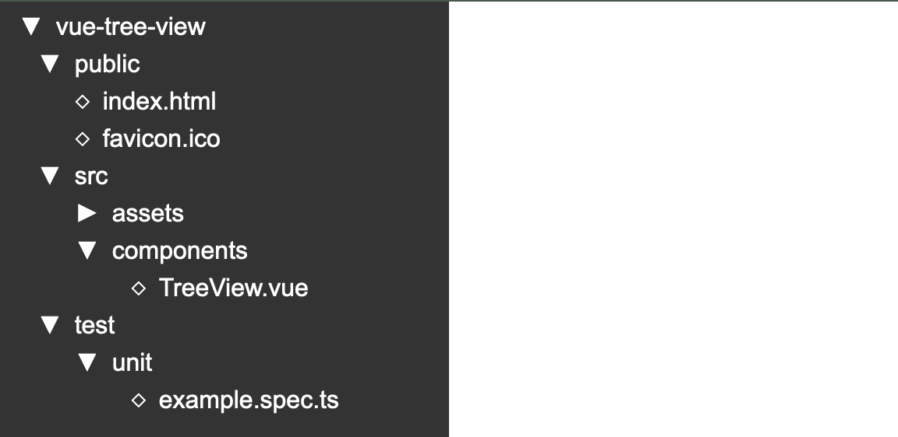

# Vue Tree View

> An example of a tree view component created using Vue and Typescript.

## Preview



## Project setup
```
npm install
```

### Compiles and hot-reloads for development
```
npm run serve
```

### Compiles and minifies for production
```
npm run build
```

### Run your tests
```
npm run test
```

### Lints and fixes files
```
npm run lint
```

### Run your unit tests
```
npm run test:unit
```
